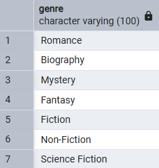
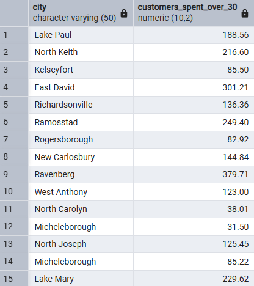

# Bookstore Sales and Customer Analytics using SQL

This project demonstrates end-to-end data analysis for a bookstore using SQL and CSV data. It covers data import, database design, business-focused SQL queries, and clear visual and written insights. The project is ideal for showcasing practical analytics skills for job applications or portfolio work.

## Data Sources
- **Books.csv**: Book details (ID, title, author, genre, year, price, stock)
- **Customers.csv**: Customer information (ID, name, email, city, country)
- **Orders.csv**: Order records (ID, customer, book, date, quantity, total amount)

## How to Use This Project

1. **Set Up the Database**
   - Use PostgreSQL (or your preferred SQL database)
   - Run `Creating table and Importing data.sql` to create tables and import data from the CSV files

2. **Run the Analysis**
   - Open `Basic and Advance SQL Queries.sql` and execute queries as needed
   - Use the provided views for modular, reusable analysis
  
## How SQL VIEW Queries Help in Data Analysis

SQL `VIEW` queries are virtual tables created by saving a SQL query with a name. They do not store data themselves but provide a way to save complex queries for easy reuse. Here's how they help in data analysis, especially in this project:

### 1. Simplify Complex Queries
- **Benefit:** Instead of writing long or complex queries every time, you can create a VIEW and select from it as if it were a table.
- **Example:** The view `Total_Books_Sold_Each_Genre` lets you instantly see sales by genre without repeating the join and aggregation logic.

### 2. Improve Readability and Collaboration
- **Benefit:** Views make SQL code easier to read and maintain, especially for teams.
- **Example:** A teammate can use `SELECT * FROM Most_Expensive_Book;` without needing to know the underlying logic.

### 3. Enable Modular Analysis
- **Benefit:** You can build new queries on top of views, layering analysis step by step.
- **Example:** Use the `Orders_Placed_Nov_2023` view to further analyze November sales by customer or book.

### 4. Enhance Security and Access Control
- **Benefit:** Restrict users to only the data they need by granting access to views instead of raw tables.
- **Example:** Give marketing staff access to a view of customer emails and cities, but not sensitive order or payment data.

### 5. Consistency Across Reports
- **Benefit:** Views ensure everyone is using the same logic for key metrics, reducing errors and inconsistencies.
- **Example:** The `Total_Revenue` view guarantees that all revenue reports use the same calculation.

### 6. Performance Optimization (in some databases)
- **Benefit:** Some databases optimize views for faster query performance, especially for frequently used aggregations.


  ## Screenshot Section

For each query, you will find the SQL and a corresponding image visualizing the result.

---

### 1. Retrieve all books in the "Fiction" genre
**Query:**
```sql
SELECT * FROM All_Books_Fiction;
```
**Image:**  


---

### 2. Find books published after the year 1950
**Query:**
```sql
SELECT * FROM After_1950;
```
**Image:**  


---

### 3. List all customers from Canada
**Query:**
```sql
SELECT * FROM All_Customers_Canada;
```
**Image:**  


---

### 4. Show orders placed in November 2023
**Query:**
```sql
SELECT * FROM Orders_Placed_Nov_2023;
```
**Image:**  


---

### 5. Retrieve the total stock of books available
**Query:**
```sql
SELECT * FROM Total_Stock;
```
**Image:**  


---

### 6. Find the details of the most expensive book
**Query:**
```sql
SELECT * FROM Most_Expensive_Book;
```
**Image:**  


---

### 7. Show all customers who ordered more than 1 quantity of a book
**Query:**
```sql
SELECT * FROM Ordered_More_Than_1;
```
**Image:**  


---

### 8. Retrieve all orders where the total amount exceeds $20
**Query:**
```sql
SELECT * FROM Amount_Exceeds_20;
```
**Image:**  


---

### 9. List all genres available in the Books table
**Query:**
```sql
SELECT * FROM Genres_Available;
```
**Image:**  


---

### 10. Find the book with the lowest stock
**Query:**
```sql
SELECT * FROM Lowest_Stock;
```
**Image:**  


---

### 11. Calculate the total revenue generated from all orders
**Query:**
```sql
SELECT * FROM Total_Revenue;
```
**Image:**  


---

### 12. Retrieve the total number of books sold for each genre
**Query:**
```sql
SELECT * FROM Total_Books_Sold_Each_Genre;
```
**Image:**  


---

### 13. Calculates the average total amount for orders of books categorized as 'Fantasy'
**Query:**
```sql
SELECT * FROM Average_Price_Fantasy;
```
**Image:**  


---

### 14. List customers who have placed at least 2 orders
**Query:**
```sql
SELECT * FROM At_Least_2_Orders;
```
**Image:**  


---

### 15. Find the title of the most frequently ordered book
**Query:**
```sql
SELECT * FROM Frequently_Ordered_Book;
```
**Image:**  


---

### 16. Show the top 3 most expensive books of 'Fantasy' Genre
**Query:**
```sql
SELECT * FROM Top_3_Most_Expensive_Books;
```
**Image:**  


---

### 17. Retrieve the total quantity of books sold by each author
**Query:**
```sql
SELECT * FROM Total_Quantity_Sold_By_Author;
```
**Image:**  


---

### 18. List the cities where customers who spent over $30 are located
**Query:**
```sql
SELECT * FROM Customers_Spent_Over_30;
```
**Image:**  


---

### 19. Find the customer who spent the most on orders
**Query:**
```sql
SELECT * FROM Customer_Spent;
```
**Image:**  


---

### 20. Calculate the stock remaining after fulfilling all orders
**Query:**
```sql
SELECT * FROM Remaining_Quantity;
```
**Image:**  


---

## Skills Demonstrated
- Data import and cleaning
- Relational database design
- Advanced SQL (joins, aggregation, views)
- Business analysis and reporting
- Data visualization
- Communication and documentation
